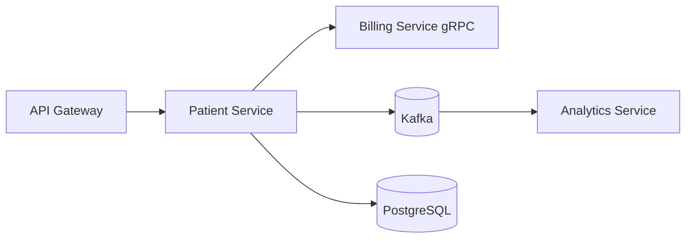

# Patient Manager

A Java/Spring microservices project for patient management with gateway routing, gRPC integration, and event-driven processing.

## Overview

The repository includes multiple Spring Boot services:

- **patient-service**: primary patient CRUD API
- **billing-service**: billing logic + gRPC server
- **analytics-service**: event consumer/analytics processing
- **api-gateway**: routing entry point

Supporting infrastructure includes PostgreSQL and Kafka via Docker Compose.

## Architecture / Stack

- Java 21, Spring Boot 3.x
- Spring Data JPA + PostgreSQL
- Apache Kafka for async events
- gRPC for inter-service communication
- Maven build



## Quickstart

### Prerequisites

- Java 21+
- Maven 3.9+
- Docker + Docker Compose

### Build

Run from each service module (no single root parent pom):

```bash
cd patient-service && ./mvnw clean package
cd ../billing-service && mvn clean package
cd ../analytics-service && mvn clean package
cd ../api-gateway && mvn clean package
```

## Environment Variables

Service-specific config is mostly in `application.yml`/`application.properties`.
Common values include:

- `SPRING_DATASOURCE_URL`
- `SPRING_DATASOURCE_USERNAME`
- `SPRING_DATASOURCE_PASSWORD`
- `SPRING_KAFKA_BOOTSTRAP_SERVERS`
- `BILLING_SERVICE_URL`

For containerized local setup, defaults are provided in compose files.

## Run

### Option A: Docker Compose (recommended)

```bash
docker compose -f docker-compose.yaml up -d
```

### Option B: Run services individually

```bash
cd patient-service && ./mvnw spring-boot:run
# in separate terminals:
cd billing-service && mvn spring-boot:run
cd analytics-service && mvn spring-boot:run
cd api-gateway && mvn spring-boot:run
```

## Test

Run in each module:

```bash
# wrapper-based
./mvnw test

# maven-based
mvn test
```

## Deployment

- Dockerfiles are present for services
- Compose stack available for local/integration deployment
- Kubernetes manifests can be added/extended as needed

## API snippets

From `patient-service`:

- `GET /api/v1/patients`
- `GET /api/v1/patients/{id}`
- `POST /api/v1/patients`
- `PUT /api/v1/patients/{id}`
- `DELETE /api/v1/patients/{id}`

Example request (`POST /api/v1/patients`):

```json
{
  "firstName": "Jane",
  "lastName": "Doe",
  "email": "jane.doe@example.com",
  "phoneNumber": "+1-555-123-4567",
  "birthDate": "1990-01-15",
  "registeredDate": "2024-01-15",
  "gender": "FEMALE",
  "address": "456 Elm Street"
}
```

## Troubleshooting

- **Database connection issues**
  - Ensure PostgreSQL is running and credentials match service config.
- **Kafka connectivity errors**
  - Verify Kafka broker host/port and Docker network readiness.
- **gRPC call failures**
  - Confirm billing service is up and `BILLING_SERVICE_URL` is correct.
- **Port conflicts**
  - Update service `server.port` values in config files.

## Changelog

See [CHANGELOG.md](CHANGELOG.md).

## License

MIT — see [LICENSE](LICENSE).
